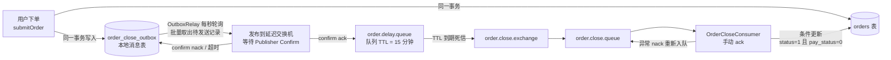

# 苍穹外卖 · RabbitMQ 延迟关单改造说明

> 改造目标：将"待支付订单超时取消"从定时任务全表扫描，升级为基于 RabbitMQ 的可靠延迟关单流程。
> 改造日期：2026-09-10 ｜ 涉及模块：`sky-server`、`sky-pojo` ｜ 状态：已实现并通过测试（16/16）

---

## 1. 背景：原方案存在的问题

原实现依赖 `OrderTask.processTimeoutOrder()` 每分钟扫描一次订单表：

```java
@Scheduled(cron = "0 * * * * ?")  // 每分钟触发一次
public void processTimeoutOrder() { ... }
```

存在三个工程问题：

| # | 问题 | 影响 |
|---|------|------|
| 1 | **定时扫描精度差、开销大** | 关单时刻最多延迟 1 分钟；订单表增长后每分钟一次的条件查询成为常态化负载 |
| 2 | **afterCommit 发送消息存在丢消息窗口**（若改用"下单后直接发 MQ"的常见做法） | 数据库事务提交成功后、消息发出前应用宕机，消息永久丢失，订单永远不会被取消 |
| 3 | **"先查询再更新"的关单竞态** | 消费者查到订单待支付后、执行取消前，支付回调刚好完成支付 → 误取消已支付订单 |

本次改造针对以上三点，采用**事务性本地消息表（Transactional Outbox）+ RabbitMQ TTL 死信队列 + 原子条件更新**的组合方案。

## 2. 方案总览



一次下单的完整链路：

1. `submitOrder` 在**同一个数据库事务**内插入订单和一条 outbox 记录（要么都成功，要么都回滚）；
2. `OrderCloseOutboxRelay` 定时（默认每秒）批量捞出到期待发送的 outbox 记录，发布到延迟队列并**等待 RabbitMQ 的发布确认**；
3. 消息在 `order.delay.queue` 中停留 15 分钟（队列级 TTL），到期后由死信机制转入 `order.close.queue`；
4. 消费者执行**原子条件更新**关单；成功（或订单已支付）则 ack，处理异常则 nack 重新入队。

### 2.1 三个问题的对应解法

| 原问题 | 解法 | 关键机制 |
|--------|------|----------|
| 定时扫描 | 每个订单一条延迟消息，到点精准触发 | 队列 `x-message-ttl` + `x-dead-letter-exchange` |
| afterCommit 丢消息 | 消息意图先落库，与订单同事务提交；发送与重试由后台补偿 | 事务性本地消息表 + 发布确认 |
| 并发误取消 | 关单是单条带条件的 UPDATE，数据库行锁保证原子性 | `where ... status = 1 and pay_status = 0` |

## 3. 关键设计决策

| 决策 | 理由 |
|------|------|
| **本地消息表而非 afterCommit 直接发送** | 消息写入与订单同事务，杜绝"提交后、发送前宕机"的丢消息窗口；宕机重启后 relay 仍能从表中恢复发送 |
| **队列级 TTL（单一固定 15 分钟）而非每条消息 TTL** | 消息级 TTL 在同一队列中必须等队头消息过期才能死信（队头阻塞）；当前业务只有一个超时档位，队列级 TTL 语义正确且实现简单 |
| **不依赖 rabbitmq_delayed_message_exchange 插件** | TTL + DLX 是 RabbitMQ 原生能力，本地/生产环境无需安装插件 |
| **发布确认（publisher confirm + return）** | relay 发送后阻塞等待 correlated confirm，nack/超时/消息被退回均视为发送失败并记录重试，杜绝"消息进了网络黑洞" |
| **关单用条件 UPDATE 而非查后改** | `update orders set ... where id=? and status=1 and pay_status=0` 单语句原子完成"检查 + 取消"，与支付回调天然互斥 |
| **消费者手动 ack** | 关单逻辑抛异常（如数据库不可用）时 nack 重新入队，消息不丢；订单已支付返回 0 行是正常结果，直接 ack |
| **outbox 表 `uk_order_id` 唯一键** | 一单一消息，重复下单重试 / relay 重复扫描天然幂等 |

## 4. 文件清单

### 4.1 新增

| 文件 | 职责 |
|------|------|
| `sky-pojo/.../entity/OrderCloseOutbox.java` | outbox 实体（status：0 待发送 / 1 已发送） |
| `sky-server/.../config/RabbitMQConfig.java` | 交换机/队列/绑定声明、JSON 序列化 |
| `sky-server/.../mq/OrderMqConstant.java` | 交换机、队列、路由键常量 |
| `sky-server/.../mq/OrderCloseProducer.java` | 在订单事务内写入 outbox 记录 |
| `sky-server/.../mq/OrderCloseMessagePublisher.java` | 发布消息并等待 publisher confirm |
| `sky-server/.../mq/OrderCloseOutboxRelay.java` | 定时批量投递 outbox，失败调度重试 |
| `sky-server/.../mq/OrderCloseConsumer.java` | 监听死信队列，执行关单 + 手动 ack |
| `sky-server/.../service/OrderCloseService.java` + `impl/OrderCloseServiceImpl.java` | 原子关单服务 |
| `sky-server/.../mapper/OrderCloseOutboxMapper.java` + `mapper/OrderCloseOutboxMapper.xml` | outbox 增删查改 |
| `docs/sql/order-close-outbox.sql` | outbox 建表 DDL（含两个唯一键与待发送索引） |

### 4.2 修改

| 文件 | 变更 |
|------|------|
| `OrderServiceImpl.java` | `submitOrder` 事务内、订单插入后调用 `orderCloseProducer.createMessage(orders.getId())` |
| `OrderMapper.java` / `OrderMapper.xml` | 新增 `closeIfPending` 条件更新语句 |
| `OrderTask.java` | **删除** `processTimeoutOrder()` 超时扫描；**保留** `processDeliveryOrder()`（派送中订单每日核对，职责不同） |
| `pom.xml`（sky-server） | 引入 `spring-boot-starter-amqp` |
| `application.yml` | RabbitMQ 连接（localhost:5672 默认）、publisher confirm、手动 ack、prefetch |
| `application-dev.example.yml` | RabbitMQ 连接的环境变量模板 |

### 4.3 新增测试（16 个，全部通过）

| 测试 | 覆盖点 |
|------|--------|
| `RabbitMQConfigTest` | 延迟队列 TTL/DLX 参数、close 队列持久化 |
| `OrderCloseOutboxSqlContractTest` | DDL 唯一键、mapper 只查"待发送且到重试时间"的记录 |
| `OrderCloseOutboxRelayTest` | 发布成功置已发送；发布失败累计重试次数并推迟下次发送时间 |
| OrderCloseProducerTest | 下单侧写入 pending outbox，载荷只包含 orderId |
| OrderCloseMessagePublisherTest | broker ack 成功和 nack 失败均有覆盖 |
| `OrderCloseSqlContractTest` | SQL 谓词必须含 `status = #{pendingStatus}` 和 `pay_status = #{unpaidStatus}`，防止竞态保护被改坏 |
| `OrderCloseServiceImplTest` | 服务委托条件更新并传递正确状态常量 |
| `OrderCloseConsumerTest` | 成功 ack；异常 nack 重新入队 |
| `OrderServiceImplOutboxContractTest` | 下单在事务内写 outbox；旧超时扫描已删、派送任务保留 |

## 5. 核心实现

### 5.1 下单接入（与订单同事务）

```java
// OrderServiceImpl#submitOrder，方法已有 @Transactional
orderMapper.insert(orders);

// 在同一事务内写入延迟关单 outbox 记录，保证订单与关单消息的原子性
orderCloseProducer.createMessage(orders.getId());
```

### 5.2 原子关单 SQL（竞态保护的核心）

```xml
<update id="closeIfPending">
    update orders
    set status = #{closedStatus},
        cancel_reason = #{cancelReason},
        cancel_time = #{cancelTime}
    where id = #{id}
      and status = #{pendingStatus}   <!-- 1 待支付 -->
      and pay_status = #{unpaidStatus} <!-- 0 未支付 -->
</update>
```

订单若已支付（或已被取消），`where` 不命中、返回 0 行——消费者将其视为正常业务结果直接 ack，不会误取消。

### 5.3 Outbox 投递与重试

```java
// OrderCloseOutboxRelay#publishPendingMessages（每秒执行）
List<OrderCloseOutbox> pending = outboxMapper.findPending(now, batchSize); // 有界批量
for (OrderCloseOutbox outbox : pending) {
    try {
        publisher.publish(outbox);                       // 阻塞等待 publisher confirm
        outboxMapper.markPublished(outbox.getId(), LocalDateTime.now());
    } catch (RuntimeException e) {
        outboxMapper.markRetry(outbox.getId(), retryCount + 1,
                LocalDateTime.now().plusSeconds(retryDelaySeconds), ...); // 推迟30s重试
    }
}
```

### 5.4 消费者手动 ack

```java
@RabbitListener(queues = OrderMqConstant.CLOSE_QUEUE)
public void onCloseOrder(Long orderId, Message message, Channel channel) throws IOException {
    long deliveryTag = message.getMessageProperties().getDeliveryTag();
    try {
        int closed = orderCloseService.closeIfPending(orderId);
        if (closed == 0) { /* 已支付或已取消，正常跳过 */ }
        channel.basicAck(deliveryTag, false);
    } catch (Exception e) {
        channel.basicNack(deliveryTag, false, true); // 重新入队，处理恢复后自动重放
    }
}
```

### 5.5 RabbitMQ 拓扑

```
order.delay.exchange ──order.delay──▶ order.delay.queue
                                        (durable, x-message-ttl=900000,
                                         x-dead-letter-exchange=order.close.exchange,
                                         x-dead-letter-routing-key=order.close)
order.close.exchange ──order.close──▶ order.close.queue (durable)
```

## 6. 配置项

RabbitMQ 连接位于 `application.yml`（支持环境变量覆盖，见 `application-dev.example.yml`）：

```yaml
spring:
  rabbitmq:
    host: ${sky.rabbitmq.host:localhost}
    port: ${sky.rabbitmq.port:5672}
    publisher-confirm-type: correlated   # 发布确认
    publisher-returns: true
    template:
      mandatory: true                    # 不可路由消息退回而非静默丢弃
    listener:
      simple:
        acknowledge-mode: manual         # 消费者手动 ack
        prefetch: 10
```

业务参数通过 `@Value` 内置默认值，均可在 yml 的 `sky.order.*` 下覆盖：

| 配置键 | 默认值 | 说明 |
|--------|--------|------|
| `sky.order.timeout-minutes` | 15 | 支付超时时间（分钟），即队列 TTL |
| `sky.order.outbox-batch-size` | 100 | relay 单次批量发送条数 |
| `sky.order.outbox-relay-delay-ms` | 1000 | relay 轮询间隔 |
| `sky.order.outbox-retry-delay-seconds` | 30 | 发布失败后的重试间隔 |
| `sky.order.publisher-confirm-timeout-ms` | 5000 | 等待 broker confirm 的超时 |

## 7. 部署 / 本地运行前置条件

1. **建表**：执行 `docs/sql/order-close-outbox.sql`（无迁移框架，需手动执行；表缺失时启动后下单会报 SQL 错误，属于显式失败）；
2. **RabbitMQ**：本地 `localhost:5672`（默认 guest/guest），队列与绑定由 `RabbitMQConfig` 声明式自动创建，无需手动建；
3. 无需安装任何 RabbitMQ 插件。

### 本地验证路径

下单后不支付 → 观察 outbox 表该订单记录数秒内变为 `status=1`（已发送）→ 15 分钟后订单自动变为"已取消"，`cancel_reason = 支付超时，自动取消`；期间完成支付则订单不会被取消（消费者 ack 跳过）。

## 8. 测试与验证结果

- 功能测试命令：mvn -pl sky-server -am -Dtest=RabbitMQConfigTest,OrderCloseOutboxSqlContractTest,OrderCloseOutboxRelayTest,OrderCloseMessagePublisherTest,OrderCloseProducerTest,OrderCloseSqlContractTest,OrderCloseServiceImplTest,OrderCloseConsumerTest,OrderServiceImplOutboxContractTest -DfailIfNoTests=false test（JDK 23）：**16 个功能测试全部通过**；
- `mvn clean package -DskipTests`：构建成功；
- 当前工作区另有被 sky-take-out/.gitignore 忽略的旧草稿测试：SpringDataRedisTest 未初始化注入，HttpClientTest 依赖外部 HTTP；本次只提交并验收消息队列功能测试，二者不属于改造范围。

## 9. 已知局限与后续优化方向

| 局限 | 说明 | 优化方向 |
|------|------|----------|
| 单一固定 TTL | 队列级 TTL 只支持一个超时档位 | 多档位时改用延迟插件或多条不同 TTL 的延迟队列 |
| 消费失败无限重入队 | 数据库长时间故障时消息会在队列中反复重放 | 引入重试上限 + 专用死信告警队列 |
| relay 单实例轮询 | 多实例部署时重复扫描由 `markPublished` 的幂等性兜底，但存在少量重复发送 | 扫描语句加分片（按 id 取模）或乐观锁抢占 |
| outbox 表无限增长 | 已发送记录永久留存 | 定期归档/清理 `status=1` 且超过保留期的记录 |
| 消息无 tracing | 排查依赖日志中的 messageId | 引入日志链路或消息轨迹 |

---

*相关文档：设计规格 `docs/superpowers/specs/2026-09-10-order-close-messaging-design.md`，执行计划 `docs/superpowers/plans/2026-09-10-order-close-messaging.md`，建表脚本 `docs/sql/order-close-outbox.sql`。*
